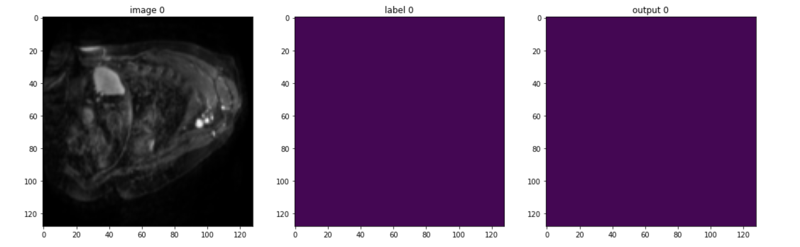
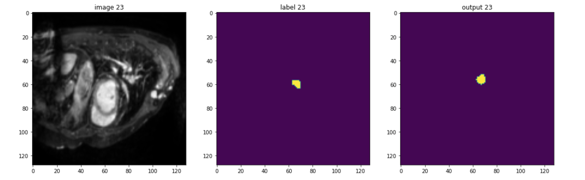
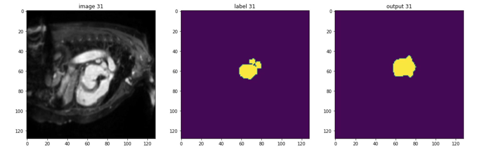

# 3D Heart Segmentation with MONAI

## Resulting predictions of training 700 epochs on 15 samples, each with 64 slices

    

    

    

<h3>Train and Test in Colab<h3>

 

<a href="http://medicaldecathlon.com/">
    Download Datasets here
</a>