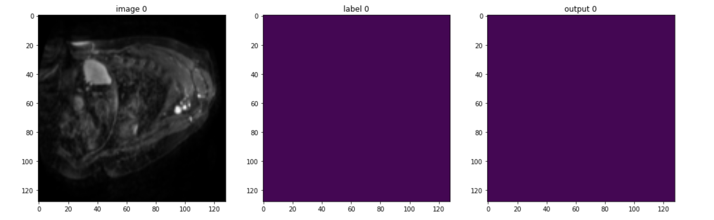
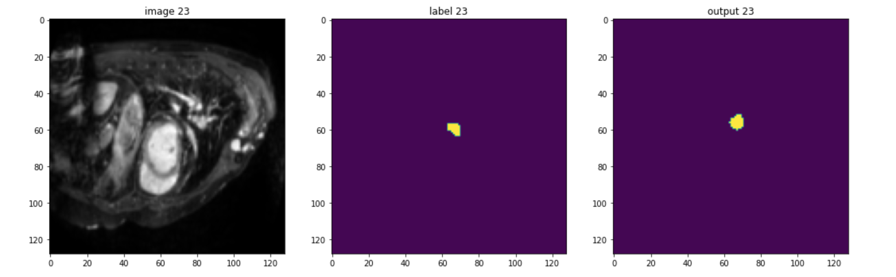
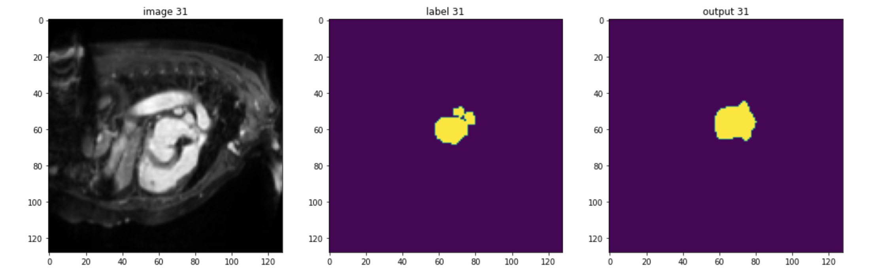
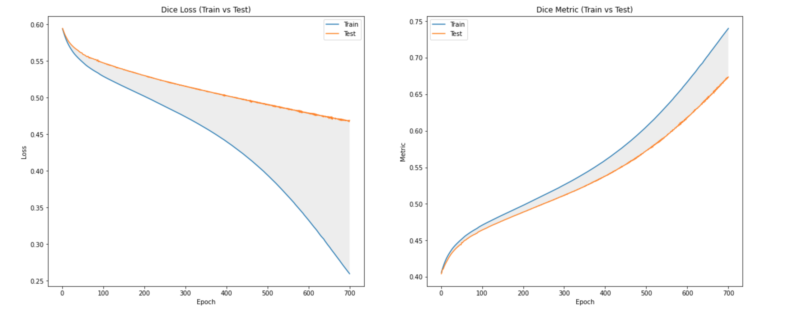

# 3D Heart Segmentation with MONAI

## Resulting predictions of training 700 epochs on 15 samples, each with 64 slices

    

 

    

 

    

 

## Training and Validating over Dice Loss and Dice Metric

    

 
    In medical imaging, there is no such a thing as perfect as other computer vision applications.
    This result is already good enough for training over only 15 samples. That can be a lot more better if there is more data and computational resources which 3D imaging takes abundance. This project is for fun only and not to be used in reallife scenerios. 

<h3>Train and Test in Colab<h3>

 

<a href="http://medicaldecathlon.com/">
    Download Datasets here
</a>